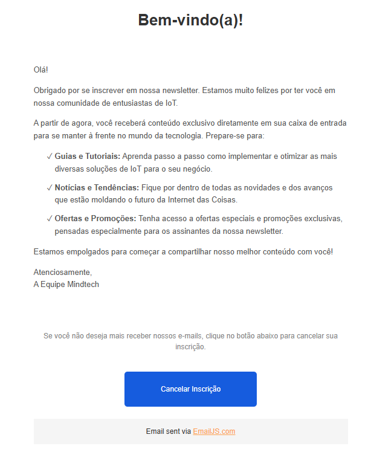

# Teste de Desenvolvimento de Software Mindtech

## Visão Geral

Este projeto consiste em um sistema completo para inscrição e descadastro em uma newsletter fictícia, dividido em duas partes principais:

-  **Frontend**: Interface de usuário para inscrição e descadastro.
-  **Backend**: API para cadastro, persistência e remoção de e-mails.

## Tecnologias Utilizadas

### Frontend

-  **React** com **TypeScript**
-  **Vite** para build e desenvolvimento
-  **TailwindCSS** para estilização

### Backend

-  **Node.js**
-  **Express**
-  **Prisma ORM**
-  **SQLite** (banco de dados local)

## Funcionamento

-  O usuário pode se inscrever na newsletter informando seu e-mail.
-  O backend valida e cadastra o e-mail, impedindo duplicidade.
- <details><summary>Ao validar e confirmar o e-mail um e-mail de boas vindas é enviado ao usuário, nele contendo um botão para se desinscrever</summary><br/> </details>

-  O projeto utiliza da lib emailjs para enviar o e-email de boas vindas junto com a opção para se desinscrever, por segurança essa é a unica forma de remover o email da lista
-  O usuário pode se descadastrar a qualquer momento acessando sua caixa de entrada.

## Como Rodar o Projeto

### Pré-requisitos

-  Node.js instalado
-  npm instalado

### Backend

1. Acesse a pasta `backend`:
   ```powershell
   cd backend
   ```
2. Instale as dependências:
   ```powershell
   npm install
   ```
3. Execute as migrações do banco de dados:
   ```powershell
   npx prisma migrate dev --name init
   ```
4. Inicie o servidor:
   ```powershell
   npm start
   ```

### Frontend

1. Acesse a pasta `frontend`:
   ```powershell
   cd frontend
   ```
2. Instale as dependências:
   ```powershell
   npm install
   ```
3. Inicie o servidor de desenvolvimento:
   ```powershell
   npm run dev
   ```

### Acesso

-  O frontend estará disponível em `http://localhost:5173`
-  O backend estará disponível em `http://localhost:3000`
